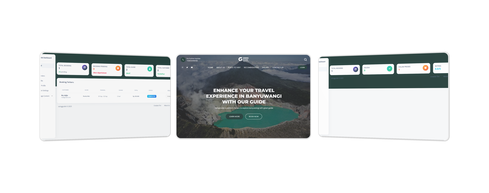
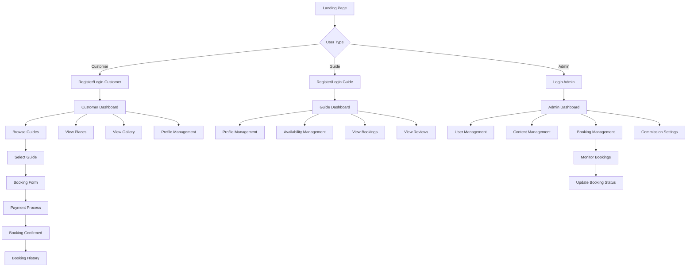

<p align="center"></p>

# 🏖️ OsingGuide - Platform Pesan Pemandu Wisata di Banyuwangi

**By:** Rio Adjie Wiguna  
**Version:** 1.0.0  
**Last Updated:** August 2025

## 📋 Table of Contents
- [Tentang Aplikasi](#-tentang-aplikasi)
- [Fitur Utama](#-fitur-utama)
- [Teknologi yang Digunakan](#️-teknologi-yang-digunakan)
- [Sistem Role](#-sistem-role)
- [Flow Aplikasi](#-flow-aplikasi)
- [Instalasi](#-instalasi)
- [Konfigurasi](#️-konfigurasi)
- [Penggunaan](#-penggunaan)
- [Contributing](#-contributing)
- [License](#-license)

## 🎯 Tentang Aplikasi

OsingGuide adalah platform digital yang menghubungkan wisatawan ataupun stakeholder pariwisata dengan pemandu wisata lokal di Banyuwangi. Aplikasi ini memudahkan pengguna untuk menemukan dan memesan pemandu wisata yang sesuai dengan kebutuhan mereka, sambil memberikan kesempatan bagi pemandu lokal untuk menawarkan layanan mereka.

## ✨ Fitur Utama

### 🏠 Landing Page
- **Tampilan Responsif**: Desain yang responsif untuk desktop, tablet, dan mobile
- **Informasi Wisata**: Detail tempat wisata di Banyuwangi
- **Galeri Foto**: Koleksi foto wisata yang menarik
- **Tentang Kami**: Informasi tentang platform dan tim
- **Kontak**: Informasi kontak dan lokasi

### 📱 Dashboard Multi-Role
- **Admin Dashboard**: Manajemen platform yang komprehensif
- **Guide Dashboard**: Interface untuk pemandu wisata
- **Customer Dashboard**: Interface untuk wisatawan

### 🔐 Sistem Autentikasi
- **Registrasi & Login**: Sistem autentikasi yang aman
- **Email Verification**: Verifikasi email untuk keamanan
- **Password Reset**: Reset password melalui email
- **Role-based Access**: Akses berdasarkan peran pengguna

## 🛠️ Teknologi yang Digunakan

### Backend
- **Laravel 10.x**: Framework PHP modern
- **MySQL**: Database management system
- **PHP 10.x**: Bahasa pemrograman server-side
- **Composer**: Dependency manager untuk PHP

### Frontend
- **Bootstrap 5**: Framework CSS untuk UI
- **Argon Dashboard**: Template admin dashboard
- **Font Awesome**: Icon library
- **jQuery**: JavaScript library
- **SCSS**: CSS preprocessor

### Tools & Libraries
- **Carbon**: Date/time manipulation
- **Laravel Sanctum**: API authentication
- **Laravel Storage**: File management
- **Laravel Validation**: Form validation

## 👥 Sistem Role

### 1. 👨‍💼 Admin
**Fitur Utama:**
- 📊 **Dashboard Admin**: Monitoring platform dan booking guide
- 🎨 **Manajemen Konten**: Tempat Wisata, Galeri, Tentang Kami, Kontak
- 👤 **Manajemen User**: Profil Guide dan Customer
- 📋 **Booking Management**: Kelola pesanan guide
- 💰 **Komisi Platform**: Pengaturan komisi dan fee
- 📈 **Analytics**: Statistik booking dan pendapatan

**Halaman Utama:**
- Dashboard dengan statistik real-time
- Manajemen guide (aktif/nonaktif, level, detail)
- Manajemen customer dan booking
- Pengaturan komisi platform
- Konten management (tenmpat wisata, galeri, tentamg kami, dan kontak)

### 2. 🧭 Guide (Pemandu Wisata)
**Fitur Utama:**
- 📊 **Dashboard Guide**: Informasi booking dan statistik
- 👤 **Profil Management**: Update profil, foto, CV, skills
- 📅 **Availability Management**: Kelola ketersediaan waktu
- 📋 **Booking Management**: Lihat dan update status booking
- ⭐ **Review Management**: Lihat review dari customer
- 🔐 **Password Management**: Update password

**Halaman Utama:**
- Dashboard dengan booking terbaru
- Edit profil (bio, experience, languages, skills, CV)
- Kelola availability (tanggal dan waktu)
- Lihat booking dan review
- Update password

### 3. 👤 Customer (Wisatawan)
**Fitur Utama:**
- 🏠 **Landing Page**: Jelajahi guide dan tempat wisata
- 🔍 **Guide Discovery**: Cari dan filter guide
- 📅 **Booking System**: Pesan guide dengan tanggal dan waktu
- 👤 **Profile Management**: Update profil dan password
- 📋 **Booking History**: Riwayat pemesanan
- ⭐ **Review System**: Berikan review untuk guide setelah selesai berwisata

**Halaman Utama:**
- Landing page dengan informasi wisata
- List guide dengan filter dan search
- Booking form dengan validasi
- Profile management
- Booking history dan review

## 🔄 Flow Aplikasi

### 📊 Diagram Alur Sistem



### 🎯 Alur Pengguna (User Flow)

#### 1. 👤 Customer Journey
```
Landing Page → Register/Login → Browse Guides → Select Guide → 
Booking Form → Payment → Confirmation → Booking History → Review
```

**Detail Flow:**
1. **Landing Page**: Customer melihat informasi wisata dan guide
2. **Registration**: Daftar akun dengan email verification
3. **Guide Discovery**: Cari guide berdasarkan kriteria
4. **Guide Selection**: Pilih guide yang sesuai
5. **Booking Process**: Isi form booking dengan validasi
6. **Payment**: Proses pembayaran (simulasi)
7. **Confirmation**: Konfirmasi booking
8. **Experience**: Menggunakan layanan guide
9. **Review**: Memberikan review dan rating

#### 2. 🧭 Guide Journey
```
Registration → Profile Setup → Availability Management → 
Receive Bookings → Service Delivery → View Reviews
```

**Detail Flow:**
1. **Registration**: Daftar sebagai guide dengan verifikasi
2. **Profile Setup**: Lengkapi profil (bio, skills, CV, foto)
3. **Availability Management**: Set ketersediaan waktu
4. **Booking Reception**: Terima notifikasi booking
5. **Service Delivery**: Laksanakan layanan
6. **Status Update**: Update status booking
7. **Review Management**: Lihat review dari customer

#### 3. 👨‍💼 Admin Journey
```
Login → Dashboard Overview → User Management → 
Content Management → Booking Monitoring → Analytics
```

**Detail Flow:**
1. **Login**: Akses admin panel
2. **Dashboard**: Monitor statistik platform
3. **User Management**: Kelola guide dan customer
4. **Content Management**: Update konten website
5. **Booking Monitoring**: Pantau semua booking
6. **Commission Settings**: Atur komisi platform
7. **Analytics**: Analisis performa platform

### 🔄 Alur Booking System

#### 📋 Booking Process Flow
```
Customer Request → Guide Availability Check → 
Booking Confirmation → Payment → Service Delivery → Review
```

**Step-by-Step Process:**

1. **Customer Request** 📝
   - Customer memilih guide
   - Mengisi form booking (tanggal, waktu, jumlah orang)
   - Sistem validasi input

2. **Availability Check** ✅
   - Sistem cek ketersediaan guide
   - Validasi tanggal dan waktu
   - Konfirmasi slot tersedia

3. **Booking Confirmation** 📋
   - Generate booking ID
   - Kirim konfirmasi ke customer
   - Notifikasi ke guide

4. **Payment Process** 💳
   - Kalkulasi total biaya
   - Proses pembayaran
   - Konfirmasi pembayaran

5. **Service Delivery** 🎯
   - Guide melaksanakan layanan
   - Update status booking
   - Monitoring progress

6. **Review & Rating** ⭐
   - Customer memberikan review
   - Rating guide
   - Feedback untuk improvement

### 🔐 Authentication Flow

#### 📧 Email Verification Process
```
Registration → Email Sent → Verification → Account Activation
```

#### 🔑 Password Reset Flow
```
Forgot Password → Email Link → Reset Form → New Password
```

#### 🔒 Role-Based Access Control
```
Login → Role Check → Redirect to Dashboard → Feature Access
```

### 📱 Mobile Responsive Flow

#### 📱 Mobile User Experience
```
Mobile Landing → Touch Navigation → Responsive Forms → 
Mobile-Optimized Booking → Mobile Payment → Mobile Review
```

### 🔄 Data Flow Architecture

#### 📊 Database Relationships
```
Users → GuideProfiles → Bookings → Reviews
Users → CustomerProfiles → Bookings → Reviews
Admin → Content Management → Platform Settings
```

#### 🚀 Caching Strategy
```
User Request → Cache Check → Database Query → 
Cache Update → Response Delivery
```

#### 📈 Monitoring Flow
```
System Metrics → Performance Monitoring → 
Alert System → Admin Dashboard
```

### 🔄 Error Handling Flow

#### ⚠️ Error Management
```
Error Detection → Logging → User Notification → 
Admin Alert → Error Resolution
```

---

**Flow ini menunjukkan bagaimana setiap komponen aplikasi saling terhubung dan bekerja sama untuk memberikan pengalaman yang seamless kepada semua pengguna.** 🔄

## 🚀 Instalasi

### 📋 Prerequisites

- **PHP** ^10.x.x
- **Composer** (latest version)
- **MySQL** ^8.0 atau **MariaDB** ^10.5
- **Node.js** ^16.x (untuk asset compilation)
- **Git** (untuk clone repository)

### ⚙️ Langkah Instalasi

1. **Clone Repository**
   ```bash
   git clone https://github.com/rioadjie/JD_049-RioAdjieWiguna-osingguide.git
   cd JD_049-RioAdjieWiguna-osingguide
   ```

2. **Install Dependencies**
   ```bash
   composer install
   npm install
   ```

3. **Environment Setup**
   ```bash
   cp .env.example .env
   php artisan key:generate
   ```

4. **Database Configuration**
   ```bash
   # Buat database baru di MySQL
   # Edit file .env dengan konfigurasi database
   DB_CONNECTION=mysql
   DB_HOST=127.0.0.1
   DB_PORT=3306
   DB_DATABASE=osingguide_db
   DB_USERNAME=your_username
   DB_PASSWORD=your_password
   ```

5. **Database Migration & Seeding**
   ```bash
   php artisan migrate
   php artisan db:seed
   ```

6. **Storage Setup**
   ```bash
   php artisan storage:link
   ```

7. **Asset Compilation**
   ```bash
   npm run dev
   # atau untuk production
   npm run build
   ```

8. **Start Application**
   ```bash
   php artisan serve
   ```

### 🌐 Web Server Setup (Optional)

Untuk production, gunakan web server seperti Apache atau Nginx:

**Apache (.htaccess sudah disediakan):**
```apache
DocumentRoot /path/to/osingguide/public
```

**Nginx:**
```nginx
server {
    listen 80;
    server_name your-domain.com;
    root /path/to/osingguide/public;
    
    index index.php index.html;
    
    location / {
        try_files $uri $uri/ /index.php?$query_string;
    }
    
    location ~ \.php$ {
        fastcgi_pass unix:/var/run/php/php8.1-fpm.sock;
        fastcgi_index index.php;
        fastcgi_param SCRIPT_FILENAME $realpath_root$fastcgi_script_name;
        include fastcgi_params;
    }
}
```

## ⚙️ Konfigurasi

### 🔧 Environment Variables

File `.env` berisi konfigurasi penting:

```env
# Database
DB_CONNECTION=mysql
DB_HOST=127.0.0.1
DB_PORT=3306
DB_DATABASE=osingguide_db
DB_USERNAME=root
DB_PASSWORD=

# Mail Configuration
MAIL_MAILER=smtp
MAIL_HOST=smtp.mailtrap.io
MAIL_PORT=2525
MAIL_USERNAME=null
MAIL_PASSWORD=null
MAIL_ENCRYPTION=null
MAIL_FROM_ADDRESS="hello@example.com"
MAIL_FROM_NAME="${APP_NAME}"

# File Upload
FILESYSTEM_DISK=public
```

### 📁 Directory Structure

```
osingguide/
├── app/
│   ├── Http/Controllers/    # Controllers
│   ├── Models/             # Eloquent Models
│   └── Providers/          # Service Providers
├── database/
│   ├── migrations/         # Database migrations
│   └── seeders/           # Database seeders
├── public/
│   ├── assets/            # Compiled assets
│   └── storage/           # File uploads
├── resources/
│   ├── views/             # Blade templates
│   ├── css/               # Source CSS
│   └── js/                # Source JavaScript
└── routes/
    ├── web.php            # Web routes
    └── api.php            # API routes
```

## 📖 Penggunaan

### 🎯 Quick Start

1. **Register sebagai Guide:**
   - Buka `/register/guide`
   - Isi informasi dasar dan verifikasi email
   - Login dan lengkapi profil guide

2. **Register sebagai Customer:**
   - Buka `/register`
   - Isi informasi dasar dan verifikasi email
   - Mulai mencari guide

3. **Admin Access:**
   - Login dengan kredensial admin
   - Akses dashboard admin untuk manajemen

### 🔑 Default Credentials

**Admin:**
- Email: admin@osingguide.com
- Password: admin123!@#

**Guide:**
- Email: rio@gmail.com
- Password: password

**Customer:**
- Email: customer@gmail.com
- Password: password

### 📱 Mobile Responsive

Aplikasi dirancang responsif untuk:
- 📱 Mobile (320px - 768px)
- 📱 Tablet (768px - 1024px)
- 💻 Desktop (1024px+)

## 🤝 Contributing

1. Fork repository
2. Create feature branch (`git checkout -b feature/AmazingFeature`)
3. Commit changes (`git commit -m 'Add some AmazingFeature'`)
4. Push to branch (`git push origin feature/AmazingFeature`)
5. Open Pull Request

### 📝 Coding Standards

- Follow PSR-12 coding standards
- Write meaningful commit messages
- Add comments for complex logic
- Write tests for new features

## 📄 License

This project is licensed under the MIT License - see the [LICENSE](LICENSE) file for details.

## 📞 Support

- **Email**: osingguide@gmail.com
<!-- - **Documentation**: [docs.osingguide.com](https://docs.osingguide.com) -->
- **Issues**: [GitHub Issues](https://github.com/rioadjie/JD_049-RioAdjieWiguna-osingguide/issues)

## 🙏 Acknowledgments

- Laravel team untuk framework yang luar biasa
- Bootstrap team untuk UI framework
- Argon Dashboard untuk template admin

---

**Made with ❤️ by Rio Adjie Wiguna**

   
